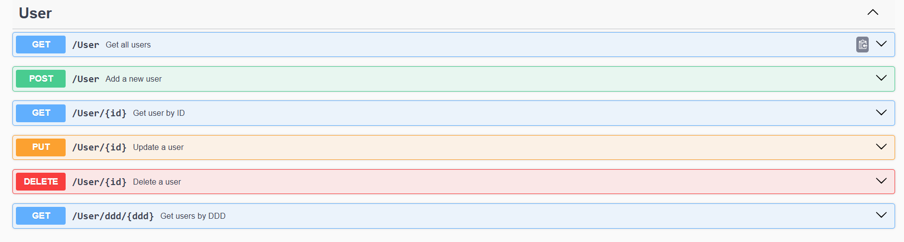

<h1 align="center">
API de Cadastro de Contatos Telefônicos
</h1>

### Projeto

Este projeto se baseia na ideia de Gerenciamento de contatos Telefônicos. Com ele é possível Adicionar um Contato junto a dados do usuário. Foi implementado no projeto design patterns, documentação e boas práticas de estruturação.

[Vídeo apresentação](apresentacao_projeto.mkv "apresentação")

## 🥷 Tecnologias

- Linguagem: C#(Sdk8.0)
- Framework: ASP.NET CORE (Dapper/EF)
- Banco de Dados: SQL Server(em container Docker)
- Entity Framework Migrations,
- implementação da documentação swagger, DataAnnotations, UnitOfWork, Singleton, Hot e Cold Cache.

## ⚒️ Configuração

Pré-requisito: Dotnet sdk8.0

1. Clone o repositório
2. Instale as dependências documentadas em **/notas.md**

## 📍End-Points API:

## 👩‍💻 Autor

Inacio Oliveira
https://www.linkedin.com/in/InacioCarvalho/
